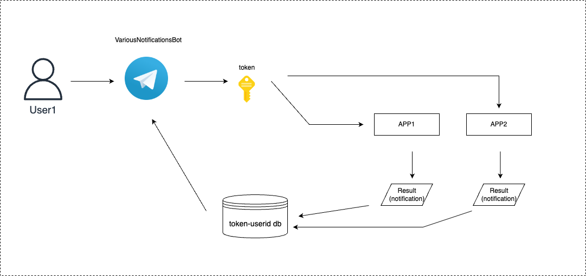

# variousnotificationsbot



Designed to bridge your apps with Telegram users effortlessly. https://t.me/variousnotificationsbot

1. User finds VariousNotificationsBot on Telegram. Presses a `/start` command. 
2. Unique token called `vnb_token` is generated and sent to the user immediately. 
3. User uses/shares this `vnb_token` with your app to get notifications. 

As a developer who wants to send a notification to your users all you have to do is send a post request: 

```sh

curl -X POST http://api.variousnotificationsbot:8188/sendNotification \
     -H "Content-Type: application/json" \ 
     -d '{"message": "YourMessageHere", "apiKey": "vnb_token_here"}'
```

or in python use this function :

```
import requests
def send_notification_(vnb_token, message ):
    """
    - message (str): The message to be sent.
    - api_key (str): The API key for authentication.

    """
    host="http://api.variousnotificationsbot.com:8188/sendNotification"
    headers = {"Content-Type": "application/json"}
    data = {
        "message": message,
        "apiKey": vnb_token
    }

    response = requests.post(host, json=data, headers=headers)
    return response.status_code, response.text
```

This service is perfect for developers and individuals who require a reliable notification system for their applications or daily tasks, without the complexity of managing a Telegram bot or navigating through the setup process to find chat IDs

For comprehensive instructions and further information, please explore our website at www.variousnotificationsbot.com.

## Key Advantages

- **Zero Setup for End-Users**: Users can integrate Telegram notifications into their applications or workflows without the need to create a Telegram bot or understand the underlying technical setup. VariousNotificationsBot handles all the complexities, allowing users to focus on what's important.
- **Universal Access**: Designed to be accessible for everyone. Whether you're a solo developer, a small startup, or just someone looking for a convenient way to receive notifications from your arduino application, VariousNotificationsBot provides a simple, unified solution.
- **Customizable and Secure**: With VariousNotificationsBot, you gain the flexibility to customize your notification preferences while ensuring that your data remains secure through encrypted communication and authenticated API access.


## Why VariousNotificationsBot?

This service was born out of the need to streamline the process of sending Telegram notifications, making it accessible and manageable for users with various technical backgrounds. By removing barriers like bot creation and chat ID retrieval, we're opening up a world of possibilities for users to integrate Telegram notifications into their lives and work seamlessly.

